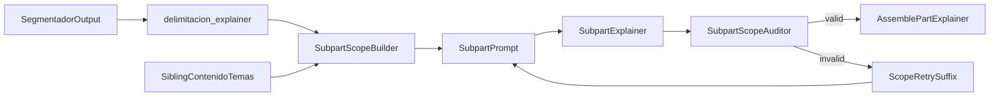

# Subpart Scope Guardrails Implementation Plan

> **For agentic workers:** REQUIRED SUB-SKILL: Use superpowers:subagent-driven-development (recommended) or superpowers:executing-plans to implement this plan task-by-task. Steps use checkbox (`- [ ]`) syntax for tracking.

**Goal:** Guarantee that every subpart explainer expands only its assigned slice of material, with explicit positive scope, explicit negative neighbor boundaries, and automatic retry when it invades adjacent subparts.

**Architecture:** The segmentador will keep producing a human-readable `identificacion`, but it will also emit a new structured `delimitacion_explainer` contract per subpart. `main.py` will turn that contract plus sibling `contenido` / `temas_cubiertos` into a stronger prompt with allowed and forbidden scope. After each subpart explainer call, a lightweight reviewer will audit whether the output stayed inside the current subpart; if not, the same subpart will be retried with a targeted correction suffix before assembly.

**Tech Stack:** Python 3.13, FastAPI pipeline in `main.py`, `google-genai`, OpenRouter explainer path, pytest.

---

## File Map

- Modify: `backend/agents/segmentador.py`
  - Add the structured `delimitacion_explainer` schema.
  - Tighten the PDF thinking protocol so the model always emits machine-usable subpart boundaries.
- Create: `backend/subpart_scope.py`
  - Parse `delimitacion_explainer`.
  - Build positive-scope and negative-scope prompt blocks.
- Modify: `main.py`
  - Inject the new scope blocks into subpart prompts.
  - Add per-subpart audit-and-retry orchestration before assembly.
- Modify: `backend/agents/explainer_prompts.py`
  - Strengthen the subpart explainer system prompt with exclusivity rules and neighbor-boundary precedence.
- Create: `backend/subpart_scope_auditor.py`
  - Build the subpart scope review prompt.
  - Parse the review JSON.
  - Build the retry suffix used to re-run a leaking subpart.
- Create: `tests/backend/test_segmentador_subpart_scope_schema.py`
  - Validate the new `delimitacion_explainer` contract in `RESPONSE_SCHEMA`.
- Create: `tests/backend/test_subpart_scope.py`
  - Validate prompt block generation from current/previous/next subparts.
- Modify: `tests/backend/test_main_helpers.py`
  - Assert that subpart prompts now contain structured positive scope and explicit negative scope.
- Create: `tests/backend/test_explainer_prompt_contract.py`
  - Lock the new subpart exclusivity wording in the shared explainer prompt.
- Create: `tests/backend/test_subpart_scope_auditor.py`
  - Unit test the audit prompt builder and retry suffix builder.
- Modify: `tests/backend/test_pdf_process_flow.py`
  - Add one focused flow test that proves a leaking subpart is retried with the correction suffix.
- Create: `tests/test_pid_00230265_subpart_scope_audit.py`
  - Live audit script for `PID_00230265.pdf`, focused on adjacent subparts and boundary clarity.

---

## Runtime Flow



---

## Task 1: Add a structured subpart boundary contract to the segmentador

**Files:**
- Modify: `backend/agents/segmentador.py`
- Create: `tests/backend/test_segmentador_subpart_scope_schema.py`

The current free-text `identificacion` is useful for humans but too weak as the only source of truth for runtime scope. The new contract must carry the same facts in structured form.

- [ ] **Step 1: Write the failing schema tests**

Create `tests/backend/test_segmentador_subpart_scope_schema.py`:

```python
"""Schema tests for structured subpart scope contracts."""

from __future__ import annotations

from google.genai import types as genai_types


def _subparte_schema():
    from backend.agents.segmentador import RESPONSE_SCHEMA

    partes_schema = RESPONSE_SCHEMA.properties["partes"]
    subpartes_schema = partes_schema.items.properties["subpartes"]
    return subpartes_schema.items


def test_delimitacion_explainer_is_required():
    schema = _subparte_schema()
    assert "delimitacion_explainer" in schema.required


def test_delimitacion_explainer_shape():
    schema = _subparte_schema()
    contract = schema.properties["delimitacion_explainer"]

    assert contract.type == genai_types.Type.OBJECT
    assert set(contract.required) == {"inicio", "fin", "transicion_compartida"}

    inicio = contract.properties["inicio"]
    assert inicio.type == genai_types.Type.OBJECT
    assert set(inicio.required) == {"encabezado", "ancla_texto"}

    fin = contract.properties["fin"]
    assert fin.type == genai_types.Type.OBJECT
    assert set(fin.required) == {"ancla_texto", "encabezado_siguiente_excluido"}

    transition = contract.properties["transicion_compartida"]
    assert transition.type == genai_types.Type.OBJECT
    assert set(transition.required) == {
        "hay_transicion",
        "pagina",
        "hasta_texto_inclusive",
        "desde_texto_inclusive",
    }
    assert transition.properties["hay_transicion"].type == genai_types.Type.BOOLEAN
    assert transition.properties["pagina"].type == genai_types.Type.INTEGER
```

- [ ] **Step 2: Run the test to verify it fails**

Run:

```bash
cd C:/Users/PcVIP/Documents/Stuff/Explainer
python -m pytest tests/backend/test_segmentador_subpart_scope_schema.py -v
```

Expected: FAIL because `delimitacion_explainer` is not present in the subpart schema yet.

- [ ] **Step 3: Add the structured contract to `backend/agents/segmentador.py`**

Update the subpart schema block so each subpart requires both the current free-text `identificacion` and the new structured contract:

```python
"delimitacion_explainer": genai.types.Schema(
    type=genai.types.Type.OBJECT,
    description=(
        "Contrato estructurado de alcance para el explainer. "
        "Es la fuente de verdad operativa para delimitar qué entra y qué no entra en la subparte."
    ),
    required=["inicio", "fin", "transicion_compartida"],
    properties={
        "inicio": genai.types.Schema(
            type=genai.types.Type.OBJECT,
            required=["encabezado", "ancla_texto"],
            properties={
                "encabezado": genai.types.Schema(
                    type=genai.types.Type.STRING,
                    description="Capítulo/apartado exacto donde empieza la subparte. Cadena vacía si no existe encabezado."
                ),
                "ancla_texto": genai.types.Schema(
                    type=genai.types.Type.STRING,
                    description="Primeras 8-15 palabras literales del primer tramo que sí pertenece a la subparte."
                ),
            },
        ),
        "fin": genai.types.Schema(
            type=genai.types.Type.OBJECT,
            required=["ancla_texto", "encabezado_siguiente_excluido"],
            properties={
                "ancla_texto": genai.types.Schema(
                    type=genai.types.Type.STRING,
                    description="Últimas 8-15 palabras literales del último tramo que sí pertenece a la subparte."
                ),
                "encabezado_siguiente_excluido": genai.types.Schema(
                    type=genai.types.Type.STRING,
                    description="Título del siguiente bloque que ya NO entra en esta subparte. Cadena vacía si no aplica."
                ),
            },
        ),
        "transicion_compartida": genai.types.Schema(
            type=genai.types.Type.OBJECT,
            required=["hay_transicion", "pagina", "hasta_texto_inclusive", "desde_texto_inclusive"],
            properties={
                "hay_transicion": genai.types.Schema(type=genai.types.Type.BOOLEAN),
                "pagina": genai.types.Schema(
                    type=genai.types.Type.INTEGER,
                    description="Página compartida con subparte vecina. Usa 0 si no hay transición compartida."
                ),
                "hasta_texto_inclusive": genai.types.Schema(
                    type=genai.types.Type.STRING,
                    description="Último texto literal que todavía pertenece a esta subparte dentro de la página compartida."
                ),
                "desde_texto_inclusive": genai.types.Schema(
                    type=genai.types.Type.STRING,
                    description="Primer texto literal a partir del cual ya empieza la subparte siguiente en la página compartida."
                ),
            },
        ),
    },
),
```

Also tighten the PDF thinking protocol for PASO 7 so the model emits the structured contract explicitly:

```python
- Además del texto `identificacion`, genera SIEMPRE `delimitacion_explainer` con la misma información en formato estructurado:
  - `inicio.encabezado`: encabezado exacto del primer bloque que entra, o cadena vacía si no hay.
  - `inicio.ancla_texto`: primeras 8-15 palabras literales del primer tramo que sí entra.
  - `fin.ancla_texto`: últimas 8-15 palabras literales del último tramo que sí entra.
  - `fin.encabezado_siguiente_excluido`: siguiente encabezado que ya no entra, o cadena vacía si no aplica.
  - `transicion_compartida`: si hay página compartida con la subparte vecina, indica página y frontera literal; si no la hay, usa `hay_transicion=false`, `pagina=0` y cadenas vacías.
```

- [ ] **Step 4: Run the schema tests again**

Run:

```bash
python -m pytest tests/backend/test_segmentador_subpart_scope_schema.py -v
```

Expected: PASS.

- [ ] **Step 5: Commit**

```bash
git add backend/agents/segmentador.py tests/backend/test_segmentador_subpart_scope_schema.py
git commit -m "feat: add structured subpart scope contract to segmentador"
```

---

## Task 2: Create reusable subpart scope helpers

**Files:**
- Create: `backend/subpart_scope.py`
- Create: `tests/backend/test_subpart_scope.py`

This file centralizes three concerns that should not live inline in `main.py`: parsing the structured contract, rendering positive scope, and rendering negative neighbor scope.

- [ ] **Step 1: Write the failing helper tests**

Create `tests/backend/test_subpart_scope.py`:

```python
"""Tests for subpart scope helper blocks."""

from __future__ import annotations


def _sp(num: int, title: str, content: str, temas: list[str], pi: int, pf: int, next_heading: str = "") -> dict:
    return {
        "numero_subparte": num,
        "titulo": title,
        "contenido": content,
        "temas_cubiertos": temas,
        "pagina_inicio": pi,
        "pagina_fin": pf,
        "delimitacion_explainer": {
            "inicio": {"encabezado": f"{num}.0 Inicio", "ancla_texto": f"Texto inicial {num}"},
            "fin": {
                "ancla_texto": f"Texto final {num}",
                "encabezado_siguiente_excluido": next_heading,
            },
            "transicion_compartida": {
                "hay_transicion": num == 2,
                "pagina": 19 if num == 2 else 0,
                "hasta_texto_inclusive": "última frase previa" if num == 2 else "",
                "desde_texto_inclusive": "nuevo encabezado" if num == 2 else "",
            },
        },
    }


def test_positive_scope_block_includes_pages_anchors_and_transition():
    from backend.subpart_scope import build_subpart_scope_contract_block

    text = build_subpart_scope_contract_block(
        _sp(2, "Cambios estructurales", "Reforma administrativa", ["Burocracia"], 19, 22, "2.4 Consejos")
    )

    assert "CONTRATO ESTRUCTURADO DE ALCANCE DE LA SUBPARTE" in text
    assert "Páginas núcleo: 19-22" in text
    assert "Texto inicial 2" in text
    assert "Texto final 2" in text
    assert "2.4 Consejos" in text
    assert "PÁGINA COMPARTIDA" in text


def test_negative_scope_block_lists_previous_and_next_neighbors():
    from backend.subpart_scope import build_subpart_negative_scope_block

    subpartes = [
        _sp(1, "Precursores", "Tomás de Aquino y Maquiavelo", ["Tomás de Aquino", "Maquiavelo"], 18, 19),
        _sp(2, "Cambios estructurales", "Reforma administrativa", ["Burocracia"], 19, 22, "2.4 Consejos"),
        _sp(3, "Consejos", "Régimen polisinodial", ["Consejos", "Audiencias"], 23, 27),
    ]

    text = build_subpart_negative_scope_block(subpartes[1], subpartes)

    assert "FRONTERAS NEGATIVAS (NO DESARROLLAR)" in text
    assert "Subparte 1 (anterior)" in text
    assert "Subparte 3 (siguiente)" in text
    assert "Tomás de Aquino" in text
    assert "Consejos" in text


def test_negative_scope_block_uses_neighbor_content_and_topics():
    from backend.subpart_scope import build_subpart_negative_scope_block

    subpartes = [
        _sp(1, "Anterior", "Contenido anterior", ["Tema anterior"], 10, 12),
        _sp(2, "Actual", "Contenido actual", ["Tema actual"], 13, 15),
    ]

    text = build_subpart_negative_scope_block(subpartes[1], subpartes)

    assert "Contenido anterior" in text
    assert "Tema anterior" in text
    assert "Tema actual" not in text


def test_scope_summary_includes_title_content_topics_and_contract():
    from backend.subpart_scope import build_subpart_scope_summary

    text = build_subpart_scope_summary(
        _sp(2, "Actual", "Contenido actual", ["Tema actual"], 13, 15, "3.0 Siguiente")
    )

    assert "Título: Actual" in text
    assert "Contenido: Contenido actual" in text
    assert "Tema actual" in text
    assert "CONTRATO ESTRUCTURADO DE ALCANCE DE LA SUBPARTE" in text
```

- [ ] **Step 2: Run the tests to verify they fail**

Run:

```bash
python -m pytest tests/backend/test_subpart_scope.py -v
```

Expected: FAIL with `ModuleNotFoundError: No module named 'backend.subpart_scope'`.

- [ ] **Step 3: Create `backend/subpart_scope.py`**

Create `backend/subpart_scope.py`:

```python
"""Helpers for subpart scope contracts and prompt blocks."""

from __future__ import annotations

from dataclasses import dataclass
from typing import Any


@dataclass(frozen=True, slots=True)
class SubpartBoundary:
    encabezado: str
    ancla_texto: str


@dataclass(frozen=True, slots=True)
class SharedTransition:
    hay_transicion: bool
    pagina: int
    hasta_texto_inclusive: str
    desde_texto_inclusive: str


@dataclass(frozen=True, slots=True)
class SubpartScopeContract:
    inicio: SubpartBoundary
    fin_ancla_texto: str
    fin_encabezado_siguiente_excluido: str
    transicion_compartida: SharedTransition


def extract_subpart_scope_contract(subparte: dict[str, Any]) -> SubpartScopeContract:
    raw = subparte.get("delimitacion_explainer") or {}
    inicio = raw.get("inicio") or {}
    fin = raw.get("fin") or {}
    transicion = raw.get("transicion_compartida") or {}
    return SubpartScopeContract(
        inicio=SubpartBoundary(
            encabezado=str(inicio.get("encabezado") or "").strip(),
            ancla_texto=str(inicio.get("ancla_texto") or "").strip(),
        ),
        fin_ancla_texto=str(fin.get("ancla_texto") or "").strip(),
        fin_encabezado_siguiente_excluido=str(fin.get("encabezado_siguiente_excluido") or "").strip(),
        transicion_compartida=SharedTransition(
            hay_transicion=bool(transicion.get("hay_transicion")),
            pagina=int(transicion.get("pagina") or 0),
            hasta_texto_inclusive=str(transicion.get("hasta_texto_inclusive") or "").strip(),
            desde_texto_inclusive=str(transicion.get("desde_texto_inclusive") or "").strip(),
        ),
    )


def build_subpart_scope_contract_block(subparte: dict[str, Any]) -> str:
    contract = extract_subpart_scope_contract(subparte)
    lines = [
        "CONTRATO ESTRUCTURADO DE ALCANCE DE LA SUBPARTE",
        f"Páginas núcleo: {subparte.get('pagina_inicio')}–{subparte.get('pagina_fin')}",
        f"Encabezado de inicio permitido: {contract.inicio.encabezado or '(sin encabezado explícito)'}",
        f"Ancla literal de inicio: {contract.inicio.ancla_texto or '(sin ancla literal)'}",
        f"Ancla literal de fin: {contract.fin_ancla_texto or '(sin ancla literal)'}",
        f"Encabezado siguiente excluido: {contract.fin_encabezado_siguiente_excluido or '(ninguno)'}",
    ]
    if contract.transicion_compartida.hay_transicion:
        lines += [
            "",
            f"PÁGINA COMPARTIDA: {contract.transicion_compartida.pagina}",
            f"- Hasta aquí pertenece a la subparte actual: {contract.transicion_compartida.hasta_texto_inclusive}",
            f"- Desde aquí deja de pertenecer a la subparte actual: {contract.transicion_compartida.desde_texto_inclusive}",
        ]
    return "\n".join(lines)


def build_subpart_negative_scope_block(subparte: dict[str, Any], all_subpartes: list[dict[str, Any]]) -> str:
    current_num = int(subparte.get("numero_subparte") or 0)
    lines = ["FRONTERAS NEGATIVAS (NO DESARROLLAR)"]
    for sibling in all_subpartes:
        sibling_num = int(sibling.get("numero_subparte") or 0)
        if sibling_num == current_num or sibling_num not in {current_num - 1, current_num + 1}:
            continue
        role = "anterior" if sibling_num < current_num else "siguiente"
        lines.append(f"- Subparte {sibling_num} ({role}): «{sibling.get('titulo', '?')}»")
        contenido = str(sibling.get("contenido") or "").strip()
        if contenido:
            lines.append(f"  Contenido vecino fuera de alcance: {contenido}")
        temas = sibling.get("temas_cubiertos") or []
        if temas:
            lines.append("  Temas prohibidos en esta ejecución:")
            for tema in temas:
                lines.append(f"    - {tema}")
    return "\n".join(lines)


def build_subpart_scope_summary(subparte: dict[str, Any] | None) -> str:
    if not subparte:
        return ""
    lines = [
        f"Título: {subparte.get('titulo', '')}",
        f"Contenido: {subparte.get('contenido', '')}",
    ]
    temas = subparte.get("temas_cubiertos") or []
    if temas:
        lines.append("Temas propios:")
        for tema in temas:
            lines.append(f"- {tema}")
    lines.append("")
    lines.append(build_subpart_scope_contract_block(subparte))
    return "\n".join(lines)
```

- [ ] **Step 4: Run the helper tests**

Run:

```bash
python -m pytest tests/backend/test_subpart_scope.py -v
```

Expected: PASS.

- [ ] **Step 5: Commit**

```bash
git add backend/subpart_scope.py tests/backend/test_subpart_scope.py
git commit -m "feat: add reusable subpart scope helper blocks"
```

---

## Task 3: Inject positive and negative scope blocks into subpart prompts

**Files:**
- Modify: `main.py`
- Modify: `tests/backend/test_main_helpers.py`

The user’s concrete request is to pass not only `identificacion`, but also the current subpart’s `contenido` / `temas_cubiertos` plus previous/next forbidden neighbors. This task makes that runtime-visible.

- [ ] **Step 1: Add failing prompt-builder tests**

Append to `tests/backend/test_main_helpers.py`:

```python
def _scope_handoff():
    import main as m

    return m.PartHandoffContext(
        titulo="Parte 2",
        resumen_alcance="Instituciones del Estado Moderno",
        temas_cubiertos=("Concepto de Estado", "Burocracia"),
        intent_usuario=None,
        continuidad_previa=None,
        vision_global_division=None,
    )


def test_build_subpart_pdf_prompt_includes_structured_scope_and_negative_neighbors():
    import main as m

    parte = {
        "numero": 2,
        "titulo": "El Estado Moderno",
        "identificacion": "Parte 2 completa",
        "pagina_inicio": 12,
        "pagina_fin": 27,
    }
    subpartes = [
        {
            "numero_subparte": 1,
            "titulo": "Precursores",
            "contenido": "Teorización política previa",
            "temas_cubiertos": ["Tomás de Aquino", "Maquiavelo"],
            "pagina_inicio": 18,
            "pagina_fin": 19,
        },
        {
            "numero_subparte": 2,
            "titulo": "Cambios estructurales",
            "contenido": "Reforma administrativa y oficiales",
            "temas_cubiertos": ["Burocracia"],
            "pagina_inicio": 19,
            "pagina_fin": 22,
            "identificacion": "NÚCLEO SEGÚN MARCAS PDF: páginas 19–22.",
            "delimitacion_explainer": {
                "inicio": {"encabezado": "2.3", "ancla_texto": "Las monarquías modernas reforzaron"},
                "fin": {"ancla_texto": "oficio público cada vez más técnico", "encabezado_siguiente_excluido": "2.4 Régimen de Consejos"},
                "transicion_compartida": {
                    "hay_transicion": True,
                    "pagina": 19,
                    "hasta_texto_inclusive": "la mención a Bodin",
                    "desde_texto_inclusive": "2.3 Cambios estructurales",
                },
            },
        },
        {
            "numero_subparte": 3,
            "titulo": "Consejos",
            "contenido": "Régimen polisinodial",
            "temas_cubiertos": ["Consejos", "Audiencias"],
            "pagina_inicio": 23,
            "pagina_fin": 27,
        },
    ]

    prompt = m._build_subpart_pdf_prompt(
        "TABLA",
        parte,
        subpartes[1],
        subpartes,
        2,
        5,
        _scope_handoff(),
        pdf_scope_mode="subpdf_buffered",
        nucleo_inicio=12,
        nucleo_fin=27,
    )

    assert "CONTRATO ESTRUCTURADO DE ALCANCE DE LA SUBPARTE" in prompt
    assert "FRONTERAS NEGATIVAS (NO DESARROLLAR)" in prompt
    assert "Subparte 1 (anterior)" in prompt
    assert "Subparte 3 (siguiente)" in prompt
    assert "Burocracia" in prompt
    assert "Tomás de Aquino" in prompt
    assert "Consejos" in prompt
```

- [ ] **Step 2: Run the prompt-builder tests to verify they fail**

Run:

```bash
python -m pytest tests/backend/test_main_helpers.py -v
```

Expected: FAIL because the current subpart prompt does not yet include the new structured scope block or explicit negative neighbor block.

- [ ] **Step 3: Modify `main.py` to use the new helpers**

At the imports near the top of `main.py`, add:

```python
from backend.subpart_scope import (
    build_subpart_negative_scope_block,
    build_subpart_scope_contract_block,
)
```

Then change `_build_subpart_context()` so it focuses on the current subpart only and stops carrying the neighbor boundary burden by itself:

```python
def _build_subpart_context(
    subparte: dict,
    all_subpartes: list[dict],
    part_id: int,
    num_partes: int,
) -> str:
    sp_num = subparte.get("numero_subparte", 1)
    total_sp = len(all_subpartes)
    sp_titulo = subparte.get("titulo", f"Subparte {sp_num}")
    sp_contenido = subparte.get("contenido", "")
    sp_temas = subparte.get("temas_cubiertos", [])

    lines: list[str] = []
    lines.append("ALCANCE PEDAGÓGICO DE LA SUBPARTE")
    lines.append(f"Estás explicando la SUBPARTE {sp_num}/{total_sp} de la Parte {part_id}/{num_partes}.")
    lines.append("Desarrolla SOLO el contenido asignado a esta subparte.")
    lines.append("")
    lines.append(f"Título: «{sp_titulo}»")
    if sp_contenido:
        lines.append(f"Contenido propio: {sp_contenido}")
    if sp_temas:
        lines.append("Temas propios a desarrollar:")
        for i, tema in enumerate(sp_temas, 1):
            lines.append(f"  {i}. {tema}")
    return "\n".join(lines)
```

Then change `_build_subpart_pdf_prompt()` so it adds the positive and negative boundary blocks explicitly:

```python
subpart_ctx = _build_subpart_context(subparte, all_subpartes, part_id, num_partes)
scope_contract = build_subpart_scope_contract_block(subparte)
negative_scope = build_subpart_negative_scope_block(subparte, all_subpartes)
sp_identificacion = subparte.get("identificacion", parte.get("identificacion", ""))

return (
    f"{toc_with_marker}\n\n"
    f"---\n\n"
    f"{handoff_body}\n\n"
    f"---\n\n"
    f"{scope}\n\n"
    f"---\n\n"
    f"{subpart_ctx}\n\n"
    f"---\n\n"
    f"{scope_contract}\n\n"
    f"---\n\n"
    f"{negative_scope}\n\n"
    f"---\n\n"
    f"IDENTIFICACIÓN LEGIBLE DE APOYO (texto del segmentador):\n{sp_identificacion}"
)
```

Mirror the same `scope_contract` / `negative_scope` insertion in `_build_subpart_text_prompt()` and `_build_subpart_youtube_prompt()`; the contract block can render harmlessly even when the structured PDF fields are absent.

- [ ] **Step 4: Run the helper tests again**

Run:

```bash
python -m pytest tests/backend/test_main_helpers.py -v
```

Expected: PASS.

- [ ] **Step 5: Commit**

```bash
git add main.py tests/backend/test_main_helpers.py
git commit -m "feat: inject positive and negative scope into subpart prompts"
```

---

## Task 4: Strengthen the subpart explainer system prompt with exclusivity rules

**Files:**
- Modify: `backend/agents/explainer_prompts.py`
- Create: `tests/backend/test_explainer_prompt_contract.py`

The current explainer prompt is optimized for exhaustive coverage. That is good for recall, but dangerous for boundary discipline. It needs an explicit precedence rule: current scope beats expansion instinct.

- [ ] **Step 1: Write the failing prompt-contract tests**

Create `tests/backend/test_explainer_prompt_contract.py`:

```python
"""Lock the subpart explainer exclusivity rules."""

from __future__ import annotations


def test_subpart_prompt_mentions_scope_exclusivity():
    from backend.agents.explainer_prompts import SUBPART_SYSTEM_INSTRUCTION

    assert "Si un bloque de alcance te dice qué NO desarrollar, obedécelo" in SUBPART_SYSTEM_INSTRUCTION
    assert "subpartes vecinas" in SUBPART_SYSTEM_INSTRUCTION
    assert "mención puente" in SUBPART_SYSTEM_INSTRUCTION


def test_subpart_prompt_gives_precedence_to_current_scope():
    from backend.agents.explainer_prompts import SUBPART_SYSTEM_INSTRUCTION

    assert "prevalece el alcance de la subparte actual" in SUBPART_SYSTEM_INSTRUCTION
```

- [ ] **Step 2: Run the tests to verify they fail**

Run:

```bash
python -m pytest tests/backend/test_explainer_prompt_contract.py -v
```

Expected: FAIL because the current `SUBPART_SYSTEM_INSTRUCTION` does not yet mention these rules.

- [ ] **Step 3: Add an exclusivity protocol to `backend/agents/explainer_prompts.py`**

Insert this block inside `SUBPART_SYSTEM_INSTRUCTION`, after `<methodological_principles>`:

```python
  <scope_exclusivity_protocol>
  **CRÍTICO - Protocolo de Exclusividad de Subparte:**

  - Si el prompt incluye un contrato estructurado de alcance, ese contrato manda sobre cualquier otra señal contextual.
  - Si el prompt incluye fronteras negativas de subpartes vecinas, NO desarrolles esos temas ni esos bloques como parte de la subparte actual.
  - Si una idea vecina aparece solo para enlazar el razonamiento, limítate a una mención puente breve; no la conviertas en desarrollo sustantivo.
  - Si percibes tensión entre "ser exhaustivo" y "no invadir la subparte vecina", prevalece el alcance de la subparte actual.
  - La exhaustividad se aplica solo a lo que pertenece a ESTA subparte, no al resto de la parte ni al documento completo.
  </scope_exclusivity_protocol>
```

- [ ] **Step 4: Run the prompt-contract tests**

Run:

```bash
python -m pytest tests/backend/test_explainer_prompt_contract.py -v
```

Expected: PASS.

- [ ] **Step 5: Commit**

```bash
git add backend/agents/explainer_prompts.py tests/backend/test_explainer_prompt_contract.py
git commit -m "feat: add exclusivity rules to subpart explainer prompt"
```

---

## Task 5: Add a subpart scope auditor and correction suffix

**Files:**
- Create: `backend/subpart_scope_auditor.py`
- Create: `tests/backend/test_subpart_scope_auditor.py`

This reviewer is the second line of defense. Prompting reduces leaks; the auditor catches the ones that still happen.

- [ ] **Step 1: Write the failing auditor tests**

Create `tests/backend/test_subpart_scope_auditor.py`:

```python
"""Tests for subpart scope auditor helpers."""

from __future__ import annotations

from backend.subpart_scope_auditor import (
    SubpartScopeAuditReport,
    build_subpart_scope_retry_suffix,
    flatten_desarrollo_text,
)


def test_flatten_desarrollo_text_preserves_section_order():
    payload = {
        "desarrollo": [
            {
                "titulo_seccion": "Uno",
                "explicacion_introductoria": "Intro uno",
                "subsecciones": [
                    {"titulo_subseccion": "A", "explicacion_detallada": "Detalle A"},
                ],
            },
            {
                "titulo_seccion": "Dos",
                "explicacion_introductoria": "Intro dos",
                "subsecciones": [
                    {"titulo_subseccion": "B", "explicacion_detallada": "Detalle B"},
                ],
            },
        ]
    }

    text = flatten_desarrollo_text(payload)
    assert "Uno" in text and "Dos" in text
    assert text.index("Uno") < text.index("Dos")


def test_retry_suffix_mentions_neighbor_leaks_and_missing_current_scope():
    report = SubpartScopeAuditReport(
        is_valid=False,
        invades_previous=("Teorización política",),
        invades_next=("Régimen polisinodial",),
        missing_current=("Burocracia de oficiales",),
        rationale="Se desarrolla material de subpartes adyacentes y falta contenido propio.",
    )

    text = build_subpart_scope_retry_suffix(report)
    assert "<correccion_alcance_subparte>" in text
    assert "Teorización política" in text
    assert "Régimen polisinodial" in text
    assert "Burocracia de oficiales" in text
    assert "SOLO corrige el alcance" in text
```

- [ ] **Step 2: Run the tests to verify they fail**

Run:

```bash
python -m pytest tests/backend/test_subpart_scope_auditor.py -v
```

Expected: FAIL with `ModuleNotFoundError: No module named 'backend.subpart_scope_auditor'`.

- [ ] **Step 3: Create `backend/subpart_scope_auditor.py`**

Create `backend/subpart_scope_auditor.py`:

```python
"""Audit whether a subpart explainer stayed inside its allowed scope."""

from __future__ import annotations

import json
from dataclasses import dataclass
from typing import Any

from google import genai
from google.genai import types

from backend.gemini_client import gemini_retry, generate_content_with_retry


MAX_SUBPART_SCOPE_AUDIT_ATTEMPTS = 2


@dataclass(frozen=True, slots=True)
class SubpartScopeAuditReport:
    is_valid: bool
    invades_previous: tuple[str, ...]
    invades_next: tuple[str, ...]
    missing_current: tuple[str, ...]
    rationale: str


def flatten_desarrollo_text(payload: dict[str, Any]) -> str:
    chunks: list[str] = []
    for section in payload.get("desarrollo") or []:
        chunks.append(str(section.get("titulo_seccion") or ""))
        chunks.append(str(section.get("explicacion_introductoria") or ""))
        for sub in section.get("subsecciones") or []:
            chunks.append(str(sub.get("titulo_subseccion") or ""))
            chunks.append(str(sub.get("explicacion_detallada") or ""))
    return "\n".join(chunk for chunk in chunks if chunk)


def build_subpart_scope_retry_suffix(report: SubpartScopeAuditReport) -> str:
    lines = [
        "<correccion_alcance_subparte>",
        "SOLO corrige el alcance de esta subparte. Mantén la calidad didáctica, pero elimina invasiones de subpartes vecinas.",
    ]
    if report.invades_previous:
        lines.append("NO desarrolles contenido de la subparte anterior:")
        for item in report.invades_previous:
            lines.append(f"- {item}")
    if report.invades_next:
        lines.append("NO desarrolles contenido de la subparte siguiente:")
        for item in report.invades_next:
            lines.append(f"- {item}")
    if report.missing_current:
        lines.append("SÍ debes desarrollar el contenido propio que falta:")
        for item in report.missing_current:
            lines.append(f"- {item}")
    lines.append(f"Motivo: {report.rationale}")
    lines.append("</correccion_alcance_subparte>")
    return "\n".join(lines)


RESPONSE_SCHEMA = types.Schema(
    type=types.Type.OBJECT,
    required=["is_valid", "invades_previous", "invades_next", "missing_current", "rationale"],
    properties={
        "is_valid": types.Schema(type=types.Type.BOOLEAN),
        "invades_previous": types.Schema(type=types.Type.ARRAY, items=types.Schema(type=types.Type.STRING)),
        "invades_next": types.Schema(type=types.Type.ARRAY, items=types.Schema(type=types.Type.STRING)),
        "missing_current": types.Schema(type=types.Type.ARRAY, items=types.Schema(type=types.Type.STRING)),
        "rationale": types.Schema(type=types.Type.STRING),
    },
)


@gemini_retry(max_retries=3)
def run_subpart_scope_auditor(
    *,
    api_key: str,
    current_subpart_summary: str,
    previous_subpart_summary: str,
    next_subpart_summary: str,
    desarrollo_payload: dict[str, Any],
    model: str,
) -> tuple[SubpartScopeAuditReport, Any]:
    client = genai.Client(api_key=api_key)
    desarrollo_text = flatten_desarrollo_text(desarrollo_payload)
    prompt = f"""
Evalúa si esta salida del explainer respeta el alcance de la subparte actual.

SUBPARTE ACTUAL:
{current_subpart_summary}

SUBPARTE ANTERIOR:
{previous_subpart_summary}

SUBPARTE SIGUIENTE:
{next_subpart_summary}

SALIDA GENERADA:
{desarrollo_text}
"""
    response = generate_content_with_retry(
        client=client,
        model=model,
        contents=prompt,
        config=types.GenerateContentConfig(
            response_mime_type="application/json",
            response_schema=RESPONSE_SCHEMA,
            thinking_config=types.ThinkingConfig(thinking_level="LOW"),
        ),
        max_retries=5,
        operation_context={"agent": "subpart_scope_auditor"},
    )
    data = json.loads(response.text)
    report = SubpartScopeAuditReport(
        is_valid=bool(data["is_valid"]),
        invades_previous=tuple(data["invades_previous"]),
        invades_next=tuple(data["invades_next"]),
        missing_current=tuple(data["missing_current"]),
        rationale=str(data["rationale"]),
    )
    return report, response.usage_metadata
```

- [ ] **Step 4: Run the auditor tests**

Run:

```bash
python -m pytest tests/backend/test_subpart_scope_auditor.py -v
```

Expected: PASS.

- [ ] **Step 5: Commit**

```bash
git add backend/subpart_scope_auditor.py tests/backend/test_subpart_scope_auditor.py
git commit -m "feat: add subpart scope auditor and retry suffix"
```

---

## Task 6: Retry leaking subparts inside the PDF process flow

**Files:**
- Modify: `main.py`
- Modify: `tests/backend/test_pdf_process_flow.py`

The current flow launches all subpart explainers in parallel and accepts their first result. That is incompatible with post-hoc retry. The fix is to wrap each subpart in its own audited execution unit, then run those units in parallel.

- [ ] **Step 1: Add the failing flow test**

Append to `tests/backend/test_pdf_process_flow.py`:

```python
def test_process_project_pdf_retries_subpart_when_scope_auditor_rejects(monkeypatch):
    pdf_path = _create_multi_page_pdf(4)
    try:
        project = {
            "id": "proj-subpart-audit",
            "name": "Doc PDF",
            "description": "Procesar todo",
            "pdf_filename": "test.pdf",
            "source_type": "pdf",
            "source_url": None,
            "status": "pending",
        }

        prompts_seen = []
        audit_attempts = {"count": 0}

        monkeypatch.setattr(main, "get_project", lambda pid, uid, include_internal=False: project)
        monkeypatch.setattr(main, "get_user_api_key", lambda uid, provider=None: "AIzaFakeKey")
        monkeypatch.setattr(main, "mask_api_key", lambda api_key: "AIza****")
        monkeypatch.setattr(main, "update_project", lambda pid, uid, payload: None)
        monkeypatch.setattr(main, "download_pdf_to_temp", lambda pid, uid: pdf_path)

        async def _send_event(project_id, payload):
            return None

        class _DummySSE:
            async def end_stream(self, project_id):
                return None

        monkeypatch.setattr(main, "send_event", _send_event)
        monkeypatch.setattr(main, "sse_manager", _DummySSE())

        from google import genai
        monkeypatch.setattr(genai, "Client", lambda api_key: object())
        monkeypatch.setattr(
            main,
            "upload_file_with_retry",
            lambda *args, **kwargs: SimpleNamespace(uri="uploaded://segment", mime_type="application/pdf"),
        )
        monkeypatch.setattr(main, "run_page_classifier", lambda *args, **kwargs: (frozenset([1, 2, 3, 4]), _usage(), {}))
        monkeypatch.setattr(
            main,
            "run_segmentador",
            lambda *args, **kwargs: (
                {
                    "analisis_texto": "Cuatro páginas",
                    "temas_identificados": ["tema1", "tema2"],
                    "decision_num_partes": 1,
                    "decision_justificacion": "Una parte",
                    "partes": [{
                        **_part_pdf_fields(1, "Única", 1, 4),
                        "subpartes": [
                            {
                                "numero_subparte": 1,
                                "titulo": "Primera",
                                "contenido": "Contenido inicial",
                                "identificacion": "NÚCLEO SEGÚN MARCAS PDF: páginas 1–2.",
                                "pagina_inicio": 1,
                                "pagina_fin": 2,
                                "temas_cubiertos": ["tema1"],
                                "delimitacion_explainer": {
                                    "inicio": {"encabezado": "1.1", "ancla_texto": "primer texto"},
                                    "fin": {"ancla_texto": "fin tema uno", "encabezado_siguiente_excluido": "1.2"},
                                    "transicion_compartida": {"hay_transicion": False, "pagina": 0, "hasta_texto_inclusive": "", "desde_texto_inclusive": ""},
                                },
                            },
                            {
                                "numero_subparte": 2,
                                "titulo": "Segunda",
                                "contenido": "Contenido final",
                                "identificacion": "NÚCLEO SEGÚN MARCAS PDF: páginas 3–4.",
                                "pagina_inicio": 3,
                                "pagina_fin": 4,
                                "temas_cubiertos": ["tema2"],
                                "delimitacion_explainer": {
                                    "inicio": {"encabezado": "1.2", "ancla_texto": "segundo texto"},
                                    "fin": {"ancla_texto": "fin tema dos", "encabezado_siguiente_excluido": ""},
                                    "transicion_compartida": {"hay_transicion": False, "pagina": 0, "hasta_texto_inclusive": "", "desde_texto_inclusive": ""},
                                },
                            },
                        ],
                    }],
                    "consideraciones_estudiante": "Seguir el orden natural",
                },
                _usage(total=40),
            ),
        )

        def _fake_subpart_explainer(api_key, file_uri, agent_prompt, model, mime_type):
            prompts_seen.append(agent_prompt)
            return (
                {
                    "desarrollo": [
                        {
                            "titulo_seccion": "Bloque",
                            "explicacion_introductoria": "Contexto",
                            "subsecciones": [
                                {"titulo_subseccion": "Detalle", "explicacion_detallada": "Texto desarrollado"}
                            ],
                        }
                    ]
                },
                _usage(total=22),
            )

        monkeypatch.setattr(main, "run_subpart_explainer", _fake_subpart_explainer)
        monkeypatch.setattr(main, "run_recorrido", lambda *args, **kwargs: ({"ok": True}, _usage()))
        monkeypatch.setattr(main, "run_resources", lambda *args, **kwargs: ({"ok": True}, _usage()))
        monkeypatch.setattr(main, "format_explainer_content", lambda api_key, explainer_data: (explainer_data, {"total_tokens": 0, "cost": 0.0, "input_tokens": 0, "output_tokens": 0}))

        def _fake_auditor(**kwargs):
            from backend.subpart_scope_auditor import SubpartScopeAuditReport
            audit_attempts["count"] += 1
            if audit_attempts["count"] == 1:
                return (
                    SubpartScopeAuditReport(
                        is_valid=False,
                        invades_previous=(),
                        invades_next=("tema2",),
                        missing_current=("tema1",),
                        rationale="Invade la siguiente subparte.",
                    ),
                    _usage(total=7),
                )
            return (
                SubpartScopeAuditReport(
                    is_valid=True,
                    invades_previous=(),
                    invades_next=(),
                    missing_current=(),
                    rationale="OK",
                ),
                _usage(total=7),
            )

        monkeypatch.setattr(main, "run_subpart_scope_auditor", _fake_auditor)

        asyncio.run(main._process_project("proj-subpart-audit", "user-123"))

        assert len(prompts_seen) >= 2
        assert any("<correccion_alcance_subparte>" in prompt for prompt in prompts_seen[1:])
    finally:
        if os.path.isfile(pdf_path):
            os.unlink(pdf_path)
```

- [ ] **Step 2: Run the flow test to verify it fails**

Run:

```bash
python -m pytest tests/backend/test_pdf_process_flow.py::test_process_project_pdf_retries_subpart_when_scope_auditor_rejects -v
```

Expected: FAIL because `main.py` does not yet call the scope auditor or append the retry suffix.

- [ ] **Step 3: Add audited subpart execution to `main.py`**

Near the other private helpers in `main.py`, add a focused wrapper:

```python
async def _run_subpart_explainer_with_scope_audit(
    *,
    run_explainer_call,
    initial_prompt: str,
    audit_context_builder,
    audit_api_key: str,
    audit_model: str,
) -> tuple[dict, Any, list[Any]]:
    prompt = initial_prompt
    reviewer_usages: list[Any] = []

    for attempt in range(MAX_SUBPART_SCOPE_AUDIT_ATTEMPTS):
        result, usage = await run_explainer_call(prompt)
        report, review_usage = await asyncio.to_thread(
            run_subpart_scope_auditor,
            api_key=audit_api_key,
            current_subpart_summary=audit_context_builder()["current"],
            previous_subpart_summary=audit_context_builder()["previous"],
            next_subpart_summary=audit_context_builder()["next"],
            desarrollo_payload=result,
            model=MODEL_CLASSIFIER,
        )
        reviewer_usages.append(review_usage)
        if report.is_valid:
            return result, usage, reviewer_usages
        prompt = f"{initial_prompt}\n\n{build_subpart_scope_retry_suffix(report)}"

    raise RuntimeError("El auditor de alcance de subparte agotó sus reintentos.")
```

Then replace the current raw `explainer_calls` list for subpart explainers with per-subpart wrapper coroutines. The important change is that each subpart now owns its own explain → audit → retry loop before `asyncio.gather` collects the final outputs:

```python
from backend.subpart_scope import build_subpart_scope_summary

subpart_jobs = []
for idx, sp_prompt in enumerate(subpart_prompts):
    subparte = (subpartes[idx] if idx < len(subpartes) else None)

    async def _job(sp_prompt=sp_prompt, subparte=subparte, idx=idx):
        def _audit_context():
            previous_sp = subpartes[idx - 1] if idx > 0 else None
            next_sp = subpartes[idx + 1] if idx + 1 < len(subpartes) else None
            return {
                "current": build_subpart_scope_summary(subparte),
                "previous": build_subpart_scope_summary(previous_sp),
                "next": build_subpart_scope_summary(next_sp),
            }

        async def _call(prompt: str):
            if use_or:
                return await asyncio.to_thread(
                    explainer_fn_or,
                    openrouter_pdf_context.source_pdf_path if use_or_canonical else segment_temp_path,
                    prompt,
                    explainer_model,
                    "application/pdf" if use_or_canonical else agent_mime_type,
                    openrouter_api_key,
                    openrouter_pdf_context.cache_entry if use_or_canonical else None,
                    openrouter_page_scopes[idx] if use_or_canonical else None,
                )
            return await asyncio.to_thread(
                explainer_fn,
                api_key,
                agent_file_uri,
                prompt,
                MODEL_AGENTS,
                agent_mime_type,
            )

        return await _run_subpart_explainer_with_scope_audit(
            run_explainer_call=_call,
            initial_prompt=sp_prompt,
            audit_context_builder=_audit_context,
            audit_api_key=api_key,
            audit_model=MODEL_CLASSIFIER,
        )

    subpart_jobs.append(_job())

results = await asyncio.gather(
    *subpart_jobs,
    asyncio.to_thread(run_recorrido, api_key, agent_file_uri, agent_prompt, MODEL_AGENTS, agent_mime_type),
    asyncio.to_thread(run_resources, api_key, agent_file_uri, agent_prompt, MODEL_AGENTS, agent_mime_type),
    return_exceptions=True,
)
```

Also update usage accounting so reviewer usage is added under a phase like `part_{part_id}_scope_audit_sp{i+1}`.

- [ ] **Step 4: Run the flow test again**

Run:

```bash
python -m pytest tests/backend/test_pdf_process_flow.py::test_process_project_pdf_retries_subpart_when_scope_auditor_rejects -v
```

Expected: PASS.

- [ ] **Step 5: Run the main regression subset**

Run:

```bash
python -m pytest tests/backend/test_main_helpers.py tests/backend/test_pdf_process_flow.py tests/backend/test_explainer_openrouter.py -v
```

Expected: PASS.

- [ ] **Step 6: Commit**

```bash
git add main.py tests/backend/test_pdf_process_flow.py tests/backend/test_main_helpers.py
git commit -m "feat: retry leaking subpart explainers after scope audit"
```

---

## Task 7: Add a live PID audit focused on adjacent subpart boundaries

**Files:**
- Create: `tests/test_pid_00230265_subpart_scope_audit.py`

The existing segmentation audit stops before the subpart explainer. This new script must prove, on the real PDF, that the prompt and reviewer work on actual adjacent subparts.

- [ ] **Step 1: Create the live audit script**

Create `tests/test_pid_00230265_subpart_scope_audit.py`:

```python
"""Live audit for subpart boundary discipline on PID_00230265.pdf."""

from __future__ import annotations

import json
import os
import sys
import time

from dotenv import load_dotenv

load_dotenv(override=True)

PROJECT_ROOT = os.path.dirname(os.path.dirname(os.path.abspath(__file__)))
sys.path.insert(0, PROJECT_ROOT)


def main() -> None:
    from backend.agents.segmentador import DEFAULT_DESCRIPTION, run_segmentador
    from backend.agents.page_classifier import run_page_classifier
    from backend.agents.explainer_openrouter import run_subpart_explainer_or
    from backend.gemini_model_routing import MODEL_CLASSIFIER, MODEL_SEGMENTADOR
    from backend.gemini_client import upload_file_with_retry
    from backend.pdf_utils import add_page_numbers
    from backend.subpart_scope import build_subpart_scope_summary
    from backend.subpart_scope_auditor import run_subpart_scope_auditor
    from main import _build_content_pages_prefix, _build_pdf_table_of_contents, _build_subpart_pdf_prompt, PartHandoffContext
    from google import genai
    from pypdf import PdfReader

    api_key = os.environ["GEMINI_API_KEY"].strip()
    openrouter_key = os.environ["OPENROUTER_API_KEY"].strip()
    pdf_path = os.path.join(PROJECT_ROOT, "PID_00230265.pdf")
    numbered = add_page_numbers(pdf_path)
    total_pages = len(PdfReader(numbered).pages)

    client = genai.Client(api_key=api_key)
    uploaded = upload_file_with_retry(client, numbered, max_retries=5)
    content_pages, _, _ = run_page_classifier(api_key, uploaded.uri, total_pages, MODEL_CLASSIFIER)
    seg_description = _build_content_pages_prefix(content_pages, total_pages) + DEFAULT_DESCRIPTION
    segmentation, _ = run_segmentador(api_key, uploaded.uri, seg_description, MODEL_SEGMENTADOR, "application/pdf", "pdf")

    report = {"pairs": []}
    toc = _build_pdf_table_of_contents(segmentation, len(segmentation["partes"]))

    for parte in segmentation.get("partes", []):
        subpartes = parte.get("subpartes") or []
        if len(subpartes) < 2:
            continue
        handoff = PartHandoffContext(
            titulo=parte["titulo"],
            resumen_alcance=parte.get("contenido", ""),
            temas_cubiertos=tuple(parte.get("temas_cubiertos", [])),
            intent_usuario=None,
            continuidad_previa=None,
            vision_global_division=None,
        )
        for idx in range(len(subpartes) - 1):
            current_sp = subpartes[idx]
            prompt = _build_subpart_pdf_prompt(
                toc,
                parte,
                current_sp,
                subpartes,
                parte["numero"],
                len(segmentation["partes"]),
                handoff,
                pdf_scope_mode="full_document",
                nucleo_inicio=parte.get("pagina_inicio"),
                nucleo_fin=parte.get("pagina_fin"),
            )
            result, _ = run_subpart_explainer_or(
                source_path=numbered,
                identificacion=prompt,
                mime_type="application/pdf",
                api_key=openrouter_key,
            )
            review, _ = run_subpart_scope_auditor(
                api_key=api_key,
                current_subpart_summary=build_subpart_scope_summary(current_sp),
                previous_subpart_summary=build_subpart_scope_summary(subpartes[idx - 1]) if idx > 0 else "",
                next_subpart_summary=build_subpart_scope_summary(subpartes[idx + 1]),
                desarrollo_payload=result,
                model=MODEL_CLASSIFIER,
            )
            report["pairs"].append(
                {
                    "parte": parte["numero"],
                    "subparte_actual": current_sp["numero_subparte"],
                    "subparte_siguiente": subpartes[idx + 1]["numero_subparte"],
                    "is_valid": review.is_valid,
                    "invades_previous": list(review.invades_previous),
                    "invades_next": list(review.invades_next),
                    "missing_current": list(review.missing_current),
                    "rationale": review.rationale,
                }
            )

    out_dir = os.path.join(PROJECT_ROOT, "test_output")
    os.makedirs(out_dir, exist_ok=True)
    out_path = os.path.join(out_dir, "pid_00230265_subpart_scope_audit.json")
    with open(out_path, "w", encoding="utf-8") as fh:
        json.dump(report, fh, ensure_ascii=False, indent=2)
    print(out_path)


if __name__ == "__main__":
    start = time.time()
    main()
    print(f"elapsed_ms={int((time.time() - start) * 1000)}")
```

- [ ] **Step 2: Run the full verification stack**

Run:

```bash
python -m pytest tests/backend/test_segmentador_subpart_scope_schema.py tests/backend/test_subpart_scope.py tests/backend/test_main_helpers.py tests/backend/test_explainer_prompt_contract.py tests/backend/test_subpart_scope_auditor.py tests/backend/test_pdf_process_flow.py -v
```

Expected: PASS.

- [ ] **Step 3: Run the live audit on the real PDF**

Run:

```bash
python tests/test_pid_00230265_subpart_scope_audit.py
```

Expected:
- writes `test_output/pid_00230265_subpart_scope_audit.json`
- every audited adjacent pair shows `is_valid: true`
- if any pair is invalid, the JSON must name the invaded neighbor scope and missing current scope explicitly.

- [ ] **Step 4: Commit**

```bash
git add tests/test_pid_00230265_subpart_scope_audit.py
git commit -m "test: add live PID audit for subpart boundary discipline"
```

---

## Implementation Notes

- Keep `identificacion` as a human-readable artifact because it is useful in audits and manual inspection.
- Treat `delimitacion_explainer` as the operational source of truth.
- Use sibling `contenido` and `temas_cubiertos` only as negative boundaries, not as extra material to explain.
- Preserve current page-buffer behavior. The new design should discipline what gets explained from the buffer, not remove the buffer itself.
- Do not broaden this work into recorrido/resources. The problem being solved here is the explainer boundary discipline.

---

## Final Verification Checklist

- `backend/agents/segmentador.py` emits machine-usable subpart boundaries.
- `main.py` passes current subpart positive scope and adjacent negative scope into every subpart prompt.
- `backend/agents/explainer_prompts.py` explicitly resolves the conflict between “be exhaustive” and “do not invade”.
- Each subpart result is audited before assembly.
- The real-PDF live audit for `PID_00230265.pdf` produces a JSON report that names any boundary leak instead of silently accepting it.
